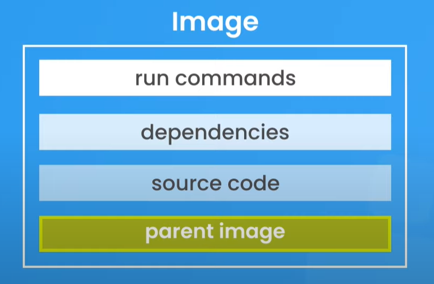

# Docker Images

## Image Layer

docker images are usually made of different layer



### Parent image

the parent image is usally pull from the docker hub to provide an OS with a basic configuration who suit our needs

# Dockerfile

Dockerfile is used to list all the layers of our image

Dockerfile Example :

```.dockerfile
# the first line our dockerfile represente the parent image the first layer
# FROM <imageName>:<version>-<distribution>
FROM node:17-alpine

# specify the work directory inside our image, for example all of the run command
# are gonna be execute inside this directory
WORKDIR /app

# Source code layer, we use this layer to copy all of our source code inside our
# image
# COPY <relative path to the source code directory> <path inside the image where we want to copy the source code>
# here we copy all of the code inside the root of the work directory (/app)
COPY . .

# Dependancy layer, this layer is where we install all of our dependancies
# RUN <command we want to run>
RUN npm install

# specify the port exposed by the container
EXPOSE 4000

# Run commands layer, here why specify the commande that should be run inside the
# container we cannot put those commands inside a RUN instruction because those
# instructions are here to setup the image and not the container
CMD [ "node", "app.js" ]
```

## Keywords

- _FROM_ is use to pull an image from the docker hub
- _COPY_ copy our source code from our project inside the image
- _RUN_ run a command -_WORKDIR_ specify the work directory inside our image
- _EXPOSE_ specify the port exposed by the container
- _CMD_ here why specify the commande that should be run inside the container

## Run the dockerfile to build an image

```.bash
docker build -t <image-name> <relative-path-to-the-dockerfile>

ex: docker build -t my-image .

```
